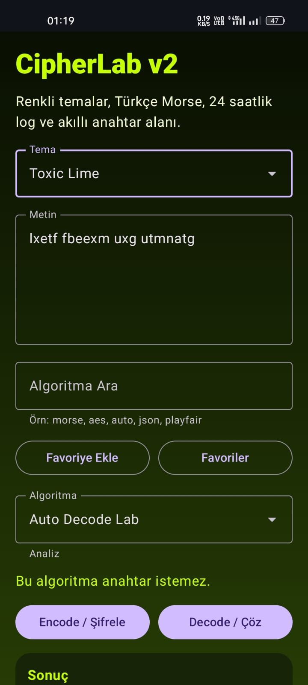
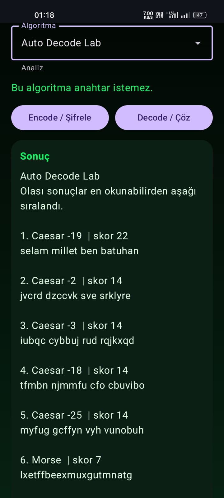
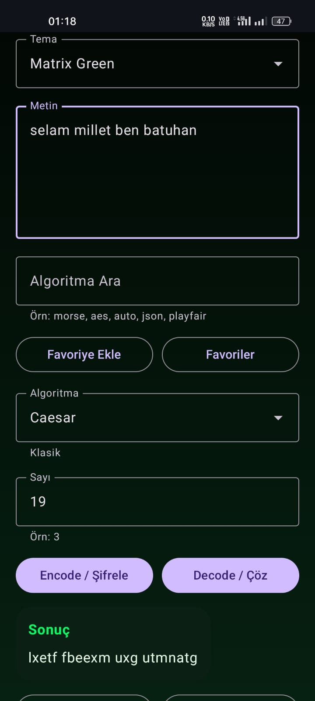
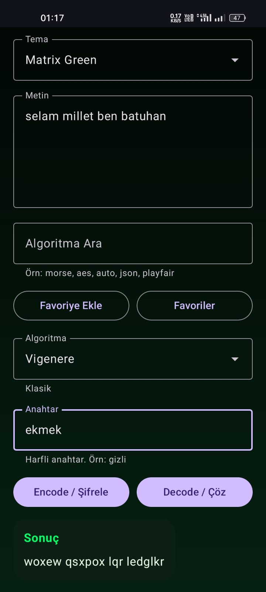
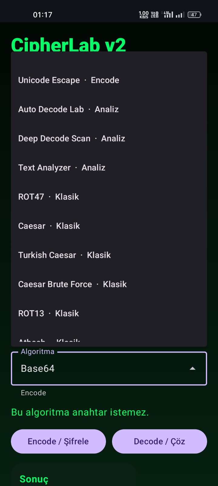
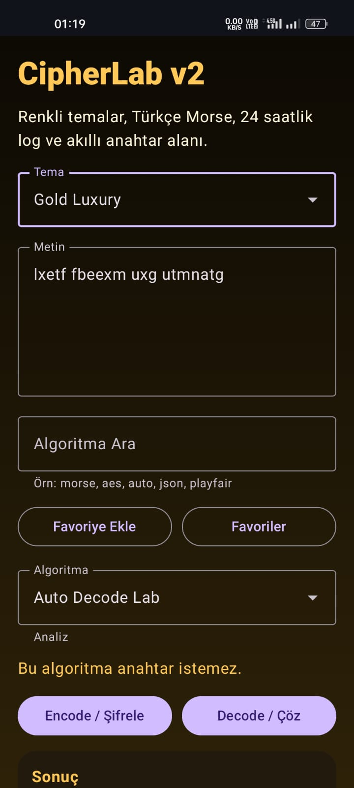
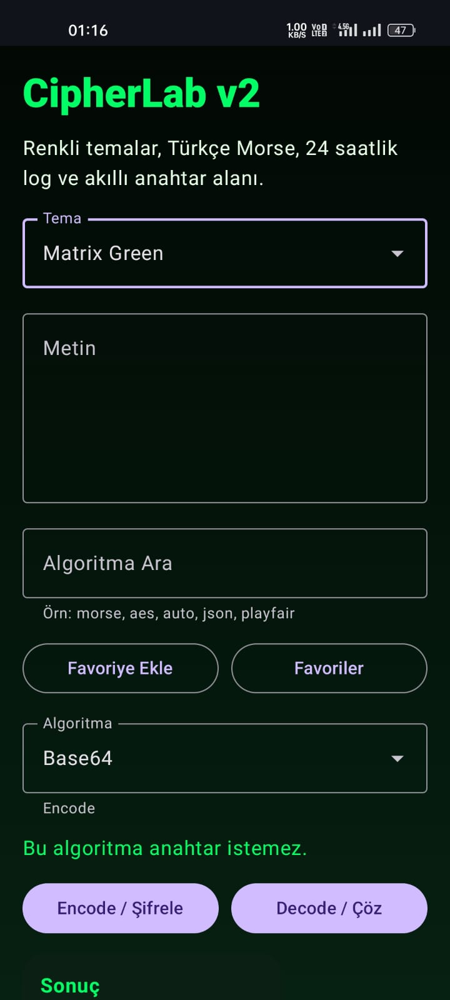
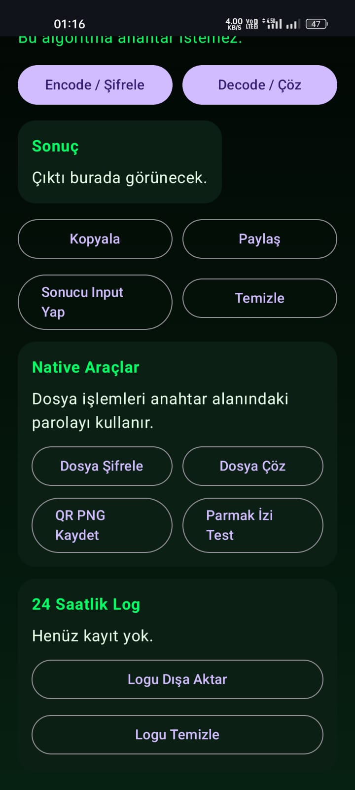

# CipherLab

CipherLab is an offline Android cryptography and encoding toolbox built with Kotlin and Jetpack Compose.

The app includes classical ciphers, modern encryption, text encoders, automatic decode analysis, QR tools, encrypted notes, file encryption, and utility tools for structured text and security workflows.

## Download

Install the latest debug APK from GitHub:

```text
https://github.com/Batuhanbey-kose/BBKCrypto/raw/main/app/build/outputs/apk/debug/app-debug.apk
```

If Android shows an unknown source warning, allow installation from the browser or file manager used to open the APK.

## Screenshots

| Home | Auto Decode | Caesar |
|---|---|---|
|  |  |  |

| Vigenere | Algorithm List | Gold Theme |
|---|---|---|
|  |  |  |

| Matrix Green | Native Tools |
|---|---|
|  |  |

## Features

- Classical ciphers: Caesar, Turkish Caesar, Vigenere, Beaufort, Gronsfeld, Affine, Playfair, Hill 2x2, Rail Fence, Columnar, Scytale, Porta, Bacon, Polybius, Tap Code, Bifid, Trifid, Nihilist, ADFGX, Pigpen, Autokey Vigenere, One-Time Pad, Enigma I
- Encoding tools: Base64, Base32, Base58, Hex, Binary, ASCII Decimal, URL, HTML Entity, Unicode Escape, ROT13, ROT47
- Text tools: Morse with Turkish characters, NATO, A1Z26, Leet, Invisible Text, Zero Width, Zalgo, Fullwidth, Small Caps, Bubble Text, Mirror Text, Upside Down, Random Case
- Auto analysis: Auto Decode Lab, Deep Decode Scan, Text Analyzer
- Modern crypto: AES-256-GCM with PBKDF2, HMAC-SHA256, MD5, SHA-1, SHA-256, SHA-512, CRC32
- Cyber utilities: JWT Decode, JSON Pretty, JSON Minify, XML Pretty, URL Parser, Regex Tester, Timestamp, UUID Generator, Hexdump, IP Subnet
- Native tools: encrypted note vault, file encryption/decryption, QR PNG export, biometric/device credential check
- App features: colored themes, favorites, algorithm search, 24-hour local history, copy/share actions

## Privacy

- Works offline
- No internet permission
- No analytics
- No remote storage
- Notes and files are encrypted locally with user-provided passwords

## Requirements

- Android Studio
- Android 8.0 or newer
- Min SDK 26

## Build

```bash
./gradlew assembleDebug
```

The debug APK is generated at:

```text
app/build/outputs/apk/debug/app-debug.apk
```

## APK File

The latest debug APK is available in the repository at:

```text
app/build/outputs/apk/debug/app-debug.apk
```

On GitHub, open the file and use `Download raw file` to install it on an Android device.

## Enigma Format

Use this format in the key field:

```text
I II III|B|01 01 01|AAA|AB CD EF
```

- `I II III`: rotors from left to right
- `B`: reflector, `B` or `C`
- `01 01 01`: ring settings
- `AAA`: initial rotor position
- `AB CD EF`: plugboard pairs

Default configuration:

```text
I II III|B|01 01 01|AAA|
```

## License

MIT
